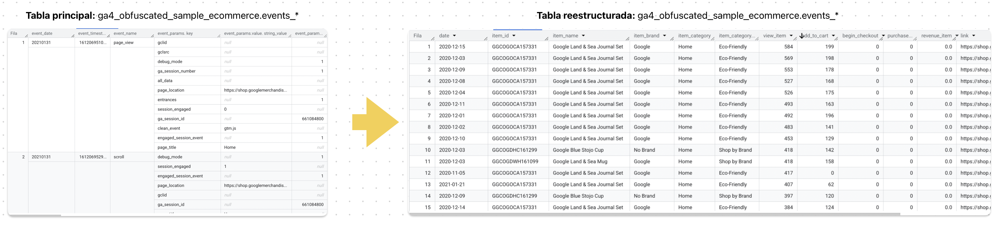

# Análisis técnico – Product Performance Insights

Este documento detalla el proceso técnico del análisis, incluyendo las fuentes de datos, lógica aplicada en SQL, construcción de la tabla maestra y hallazgos principales que alimentan el dashboard final.

---

## 1. 🧩 Fuentes de datos utilizadas

| Plataforma | Tipo de fuente     | Granularidad        | Descripción                                                                                                                                                                                                                     | ID de tabla                                                        |
|------------|--------------------|---------------------|----------------------------------------------------------------------------------------------------------------------------------------------------------------------------------------------------------------------------------|---------------------------------------------------------------------|
| BigQuery   | Pública (GA4 demo) | Evento por usuario  | Datos de muestra proporcionados por Google. Cada fila representa un evento individual registrado por Google Analytics 4 (GA4), como `page_view`, `view_item`, `add_to_cart`, `purchase`, entre otros. Ideal para prácticas de análisis de comportamiento y ecommerce. | `bigquery-public-data.ga4_obfuscated_sample_ecommerce.events`     |

**🔗 Documentación oficial del dataset:**  
[https://developers.google.com/analytics/bigquery/web-ecommerce-demo-dataset?hl=es-419](https://developers.google.com/analytics/bigquery/web-ecommerce-demo-dataset?hl=es-419)

---

## 2. 🧠 Transformación de la tabla GA4 en BigQuery


| Elemento                                                                    | Descripción                                                                                                                                                                                                                                                                                                                                                                                                                                                                   |
| --------------------------------------------------------------------------- | ----------------------------------------------------------------------------------------------------------------------------------------------------------------------------------------------------------------------------------------------------------------------------------------------------------------------------------------------------------------------------------------------------------------------------------------------------------------------------- |
| **Izquierda** – *Tabla original (`ga4_obfuscated_sample_ecommerce.events`)* | Muestra la estructura cruda de la tabla proporcionada por Google. Cada fila representa un evento individual, con parámetros anidados en campos complejos como `event_params`, `user_properties` o `items`. Esta forma es ideal para almacenamiento pero difícil de analizar directamente.                                                                                                                                                                                     |
| **Derecha** – *Tabla reestructurada*                                        | Presenta el resultado tras aplicar una limpieza y transformación en BigQuery. Los datos han sido desanidados y agregados por producto y fecha, permitiendo un análisis mucho más sencillo. Se muestran métricas clave como vistas de producto (`view_item`), agregados al carrito (`add_to_cart`), inicios de checkout, compras (`purchase`) y revenue, junto con información de producto como `item_id`, `item_name`, `item_brand`, `item_category` y un enlace al producto. |


---

## 3. 🧮 Consulta SQL principal

La siguiente consulta construye la **tabla maestra** que alimenta el dashboard final:

> 📁 Query Completa: [`queries/consulta_product_performance.sql`](../queries/rendimiento-producto-ga4-big-query.sql)

```sql
-- Fragmento ilustrativo
  SELECT
    # fecha
    PARSE_DATE('%Y%m%d', event_date) AS date,

    # item_id
    items.item_id AS item_id,

    # view_item
    SUM(CASE WHEN event_name = 'view_item' THEN IFNULL(items.quantity, 1) ELSE 0 END) AS view_item,

    # add_to_cart  
    SUM(CASE WHEN event_name = 'add_to_cart' THEN IFNULL(items.quantity, 1) ELSE 0 END) AS add_to_cart,

    # begin_checkout
    SUM(CASE WHEN event_name = 'begin_checkout' THEN IFNULL(items.quantity, 1) ELSE 0 END) AS begin_checkout,

    # purchase_item
    SUM(CASE WHEN event_name = 'purchase' THEN IFNULL(items.quantity, 1) ELSE 0 END) AS purchase_item,

    # revenue_item
    SUM(CASE WHEN event_name = 'purchase' THEN items.item_revenue ELSE 0 END) AS revenue_item,

  
  FROM
    `bigquery-public-data.ga4_obfuscated_sample_ecommerce.events_*`,
    UNNEST(items) AS items
  WHERE
      REGEXP_EXTRACT(_TABLE_SUFFIX, r"[0-9]+") BETWEEN 
      FORMAT_DATE("%Y%m%d", "2020-11-01")AND 
      FORMAT_DATE("%Y%m%d", current_date()) 
      AND items.item_id <> '(not set)'

  GROUP BY
  
    #fecha
    PARSE_DATE('%Y%m%d', event_date),

    # item_id
    item_id
```

## 4. 📊 Visualizaciones y gráficos

A continuación, algunos gráficos utilizados para obtener insights clave a partir de la tabla maestra:

| Visualización | Descripción |
|---------------|-------------|
|  | Relación entre inversión publicitaria y compras por producto. Permite detectar productos con alto gasto y baja conversión. |
|  | Funnel de conversión: vistas de producto → agregados al carrito → compras. Ayuda a identificar cuellos de botella en el proceso. |

> 🖼️ Las imágenes se encuentran en la carpeta [`images/`](../images/).

---

## 5. 🧭 Hallazgos clave

- **Desajuste entre inversión y conversión**: Se identificaron productos con alta inversión pero baja tasa de conversión (ej. *Zapatilla X*).
- **Categorías con mayor eficiencia**: Algunos segmentos, como *Accesorios*, lograron mejores resultados con menor inversión.
- **Productos con alto rendimiento orgánico**: Detectados productos con bajo gasto publicitario y alta conversión, lo que sugiere potencial para ampliar presupuesto.

---

## 6. 📈 Enlace al dashboard final

Accede al dashboard interactivo con filtros por categoría, canal publicitario y tipo de conversión:

🔗 [Ver dashboard en línea](https://lookerstudio.google.com/reporting/5e8d97c8-e7c4-4c62-93f5-0d7396d216d7)  
>  🖥️ Compatible con dispositivos móviles (responsive)

---

## 👤 Autor

**Ángel García**  
📍 Lima, Perú  
🔗 [LinkedIn](https://www.linkedin.com/in/angelgarciachanga)  
🎥 [@angelgarciadatablog](https://youtube.com/@angelgarciadatablog)

