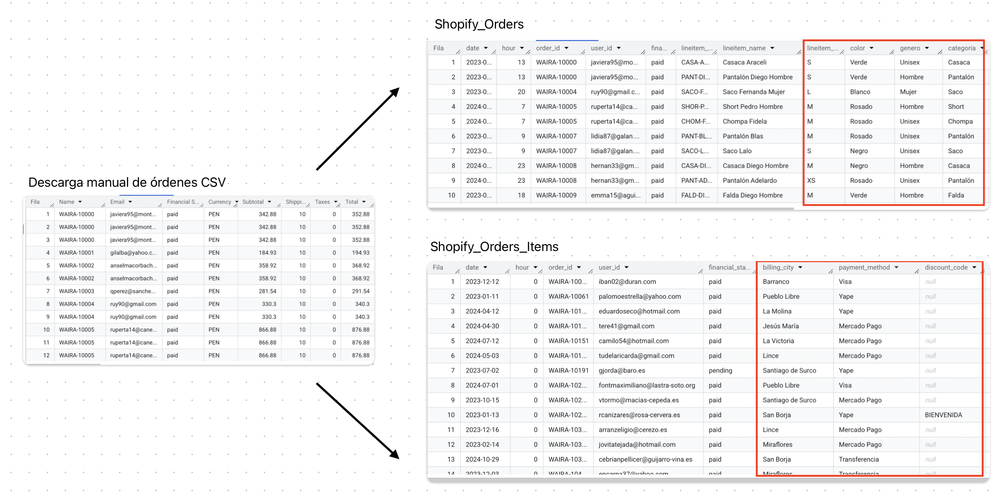

# Análisis técnico – Ecommerce Analytics Comercial

Este documento detalla el proceso técnico del análisis, incluyendo las fuentes de datos, lógica aplicada en SQL, construcción de la tabla maestra y hallazgos principales que alimentan el dashboard final.

---

## 1. 🧩 Fuentes de datos utilizadas

| Plataforma | Tipo de fuente     | Granularidad        | Descripción                                                                                                                                                                                                                     | ID de tabla                                                        |
|------------|--------------------|---------------------|----------------------------------------------------------------------------------------------------------------------------------------------------------------------------------------------------------------------------------|---------------------------------------------------------------------|
| Shopify   | Ordenes (descarga csv) | orden por cliente  | todas las órdenes generadas por la tienda | `prueba2-433703.dataset_shopify_orders_download.shopify_orders`     |

> 🔜 En una siguiente etapa, se conectará directamente con la API REST de Shopify para automatizar la recolección de datos y eliminar la dependencia de las exportaciones manuales.

---

## 2. 🧠 Transformación de la tabla GA4 en BigQuery


| Elemento | Descripción |
|----------|-------------|
| **Izquierda** – *Tabla original (`descarga de órdenes Shopify CSV`)* | Archivo CSV exportado manualmente desde Shopify que contiene todas las órdenes generadas por la tienda. Representa la fuente de datos en bruto antes de cualquier transformación o limpieza. |
| **Derecha** – *Tabla `Shopify_Orders` (nivel de orden)* | Tabla procesada en BigQuery donde cada fila representa una orden individual. Incluye información general como el ID de orden, cliente, fecha, total pagado, estado de pago, uso de cupones y ciudad de destino. Ideal para análisis a nivel de compra. |
| **Derecha** – *Tabla `Shopify_Orders_Items` (nivel de producto)* | Tabla procesada en BigQuery donde cada fila representa un producto específico vendido dentro de una orden. Contiene detalles como nombre del producto, SKU, cantidad, precio, talla, categoría, y si tuvo descuento. Esta estructura permite análisis detallados a nivel de artículo. |


---

## 3.🔄 Flujo de trabajo

1. Se descargó manualmente un archivo `.csv` con las órdenes desde la plataforma de Shopify.
2. Este archivo fue cargado como una tabla física en BigQuery, ubicada en la ruta:  
   `prueba2-433703.dataset_shopify_orders_download.shopify_orders`
3. A partir de esta tabla base se construyeron dos tablas procesadas (almacenadas en una vista) mediante consultas SQL:
   - `Shopify_Orders`: tabla con un registro por orden.
   - `Shopify_Orders_Items`: tabla con un registro por producto vendido.
4. Estas dos vistas son las que alimentan el dashboard final en Looker Studio.

   

## 3. 🧮 Consultas SQL

Las siguientes consultas construyen las tablas que alimentan el dashboard final:

> 📁 Archivo `.csv` original (órdenes de Shopify) y resultados en formato `.csv` de ambas consultas (para práctica o visualización rápida): [`2-ecommerce-analytics-comercial/files_csv`](../files_csv/)

```sql
-- Shopify Orders
SELECT
  DATE(`Created at`) AS date,
  EXTRACT(HOUR FROM `Created at`) AS hour,
  Name AS order_id, 
  Email AS user_id,
  `Financial Status` AS financial_status,
  MAX(REGEXP_EXTRACT(`Lineitem name`, r'^([^\s]+)')) AS categoria,
  MAX(
    CASE
        WHEN lower(`Lineitem name`) like '%hombre%' THEN 'Hombre'
        WHEN lower(`Lineitem name`) like '%mujer%' THEN 'Mujer'
        ELSE 'Unisex'
      END 
  ) AS genero,
  `Billing City` AS billing_city,
  `Payment Method` AS payment_method,
   NULLIF(TRIM(`Discount Code`), '') AS discount_code,
   round(AVG(`Discount Amount`)) AS discount_amount,
   round(AVG(subtotal),2) AS subtotal,
   
FROM
  `prueba2-433703.dataset_shopify_orders_download.shopify_orders`
GROUP BY
  DATE(`Created at`),
  EXTRACT(HOUR FROM `Created at`),
  Name, 
  Email,
  `Financial Status`,
  `Billing City`,
  `Payment Method`,
  `Discount Code`
```

```sql
-- Shopify Orders Items
SELECT
  DATE(`Created at`) AS date,
  EXTRACT(HOUR FROM `Created at`) AS hour,
  Name AS order_id, 
  Email AS user_id,
  `Financial Status` AS financial_status,
  `Lineitem sku` AS lineitem_sku,
  REGEXP_EXTRACT(`Lineitem name`, r'^(.*?) -') AS lineitem_name,
   REGEXP_EXTRACT(`Lineitem name`, r' - ([A-Z]+)$') AS lineitem_variant,
   REGEXP_EXTRACT(`Lineitem name`, r' - (.+?) - [A-Z]+$') AS color,
   CASE
      WHEN lower(`Lineitem name`) like '%hombre%' THEN 'Hombre'
      WHEN lower(`Lineitem name`) like '%mujer%' THEN 'Mujer'
      ELSE 'Unisex'
    END AS genero,
   REGEXP_EXTRACT(`Lineitem name`, r'^([^\s]+)') AS categoria,
   `Lineitem quantity` AS lineitem_quantity,
   round(`Lineitem price`,2) AS lineitem_price,
   round(`Lineitem quantity`*`Lineitem price`,2) AS lineitem_total,
  `Lineitem compare at price` AS lineitem_compare_at_price,
   COALESCE(round(`Lineitem compare at price`-`Lineitem price`),0) AS lineitem_discount,
   COALESCE(round((`Lineitem compare at price`-`Lineitem price`)/`Lineitem compare at price`*100,2),0) AS lineitem_percent_discount,
  CASE
    WHEN (`Lineitem compare at price`-`Lineitem price`)/`Lineitem compare at price`*100 >69 THEN 'Descuento mayor a 70%'
    WHEN (`Lineitem compare at price`-`Lineitem price`)/`Lineitem compare at price`*100 >59 THEN'Descuento entre 60% y 70%'
    WHEN (`Lineitem compare at price`-`Lineitem price`)/`Lineitem compare at price`*100 >49 THEN'Descuento entre 50% y 60%'
    WHEN (`Lineitem compare at price`-`Lineitem price`)/`Lineitem compare at price`*100 >39 THEN'Descuento entre 40% y 50%'
    WHEN (`Lineitem compare at price`-`Lineitem price`)/`Lineitem compare at price`*100 >29 THEN'Descuento entre 30% y 40%'
    WHEN (`Lineitem compare at price`-`Lineitem price`)/`Lineitem compare at price`*100 >19 THEN 'Descuento entre 20% y 30%'
    WHEN (`Lineitem compare at price`-`Lineitem price`)/`Lineitem compare at price`*100 >9 THEN'Descuento entre 10% y 20%'
    ELSE 'Sin descuento'
  END AS range_discount,

  IF(
    COALESCE(round(`Lineitem compare at price`-`Lineitem price`),0) > 0, 'Con descuento','Sin descuento'
  ) AS discount_filter,
  IF(
    `Lineitem compare at price` IS NOT NULL,`Lineitem quantity`, 0
  ) AS con_descuento_items,
    IF(
    `Lineitem compare at price` IS NULL,`Lineitem quantity`, 0
  ) AS sin_descuento_items

FROM
  `prueba2-433703.dataset_shopify_orders_download.shopify_orders`
```


## 4. 📊 Visualizaciones y gráficos

A continuación, algunos gráficos utilizados para obtener insights clave a partir de la tabla maestra:

| Visualización | Descripción |
|---------------|-------------|
|  | Descripcion |
|  | Descripcion |
|  | Descripcion |

> 🖼️ Las imágenes se encuentran en la carpeta [`images/`](../images/).

---

## 5. 🧭 Hallazgos clave

-Descripcion

---

## 6. 📈 Enlace al dashboard final

Accede al dashboard interactivo con filtros por categoría, canal publicitario y tipo de conversión:

🔗 [Ver dashboard en línea](https://lookerstudio.google.com/reporting/feceecaa-0ba9-4750-8b55-0ab20da5a5b8)

>  🖥️ Compatible con dispositivos móviles (responsive)

---

## 👤 Autor

**Ángel García**  
📍 Lima, Perú  
🔗 [LinkedIn](https://www.linkedin.com/in/angelgarciachanga)  
🎥 [@angelgarciadatablog](https://youtube.com/@angelgarciadatablog)

